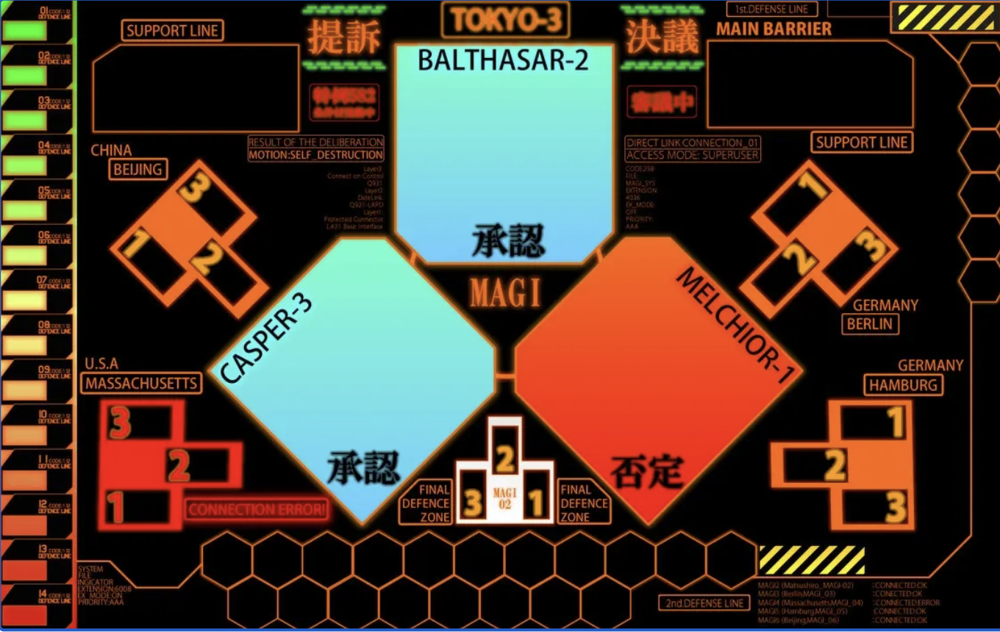

# MAGI Decision System



A web-based decision support system inspired by the MAGI supercomputers from Neon Genesis Evangelion. This system uses three different AI providers (Claude, OpenAI, and Gemini) to analyze requests and reach consensus decisions.

## 🌐 Live Demo

**[https://paulhuang1102.github.io/magi/](https://paulhuang1102.github.io/magi/)**

## Features

- **Three AI Personalities**: Each AI represents one of the MAGI computers with distinct personalities:
  - **MELCHIOR** (Claude): Scientist personality - Logic and data-driven analysis
  - **BALTHASAR** (OpenAI): Mother personality - Human impact and emotional considerations
  - **CASPER** (Gemini): Woman personality - Balance of intuition and practical concerns

- **Majority Voting System**: Final decisions are reached through democratic consensus
- **Real-time Processing**: Watch each AI analyze the request in real-time
- **Evangelion-themed UI**: Dark theme with cyberpunk aesthetics inspired by the anime
- **Secure Key Storage**: API keys stored locally in browser localStorage

## Tech Stack

- **Frontend**: React 18 + TypeScript
- **Build Tool**: Vite
- **Styling**: TailwindCSS
- **State Management**: React Context API
- **AI Providers**:
  - Anthropic Claude API
  - OpenAI GPT API
  - Google Gemini API

## Project Structure

```
MAGI_ai/
├── src/
│   ├── types/
│   │   └── ai.types.ts          # TypeScript type definitions
│   ├── services/
│   │   ├── AIBot.ts             # Abstract base class
│   │   ├── ClaudeBot.ts         # Claude implementation
│   │   ├── OpenAIBot.ts         # OpenAI implementation
│   │   └── GeminiBot.ts         # Gemini implementation
│   ├── context/
│   │   └── MAGIContext.tsx      # Global state management
│   ├── hooks/
│   │   └── useMAGI.ts           # MAGI decision logic
│   ├── components/
│   │   ├── MAGISystem.tsx       # Main container
│   │   ├── AIPanel.tsx          # Individual AI display
│   │   ├── DecisionInput.tsx    # User input
│   │   ├── DecisionResult.tsx   # Final decision display
│   │   └── Settings.tsx         # API key configuration
│   ├── App.tsx
│   ├── main.tsx
│   └── index.css
├── package.json
├── tsconfig.json
├── vite.config.ts
└── tailwind.config.js
```

## Installation

1. Clone the repository:
```bash
git clone <repository-url>
cd MAGI_ai
```

2. Install dependencies:
```bash
npm install
```

3. Start the development server:
```bash
npm run dev
```

4. Open your browser and navigate to `http://localhost:5173`

## Configuration

### API Keys Setup

You need API keys from all three providers to use the full MAGI system:

1. **Claude API Key**: Get from [Anthropic Console](https://console.anthropic.com/)
2. **OpenAI API Key**: Get from [OpenAI Platform](https://platform.openai.com/api-keys)
3. **Gemini API Key**: Get from [Google AI Studio](https://aistudio.google.com/app/apikey)

### How to Set Up API Keys

1. Click the **SETTINGS** button in the top-right corner
2. Enter your API keys for each provider
3. Click **SAVE CONFIGURATION**

API keys are stored securely in your browser's localStorage and are never sent to any third-party servers besides the respective AI providers.

## Usage

1. **Configure API Keys**: Set up your API keys in the Settings panel
2. **Enter Decision Request**: Type your question or decision request in the input area
3. **Submit to MAGI**: Click "SUBMIT TO MAGI" to start the analysis
4. **Watch Analysis**: Observe each AI's thinking process in real-time
5. **View Decision**: The system will display the final decision based on majority vote

### Example Requests

- "Should we deploy the new feature to production?"
- "Is it safe to proceed with the system upgrade?"
- "Should we approve the emergency protocol activation?"

## Decision Logic

The MAGI system uses a majority voting mechanism:

- **3 APPROVE** → Final Decision: APPROVE
- **2 APPROVE** → Final Decision: APPROVE
- **2 REJECT** → Final Decision: REJECT
- **All different** → Final Decision: NEUTRAL

Each AI provides:
- **Decision**: APPROVE / REJECT / NEUTRAL
- **Confidence**: 0-100%
- **Reasoning**: Detailed explanation

## Architecture

### AIBot Abstract Class

The `AIBot` base class provides a unified interface for all AI providers:

```typescript
abstract class AIBot {
  protected apiKey: string;
  protected name: MAGIName;
  protected personality: string;

  abstract query(prompt: string): Promise<AIResponse>;
}
```

Each AI provider extends this class:
- `ClaudeBot` - Implements Anthropic Claude API
- `OpenAIBot` - Implements OpenAI GPT API
- `GeminiBot` - Implements Google Gemini API

### State Management

The application uses React Context API for global state:
- API keys configuration
- MAGI instances status
- Current decision results
- Processing state

## Security Considerations

- API keys are stored in browser localStorage
- No server-side storage of credentials
- Direct API calls from browser to AI providers
- Never share your API keys
- Do not use on public/shared computers

## Development

### Build for Production

```bash
npm run build
```

### Preview Production Build

```bash
npm run preview
```


## Future Enhancements

- [ ] Decision history tracking
- [ ] Export decision reports
- [ ] Custom personality prompts
- [ ] Dark/Light theme toggle
- [ ] Sound effects (anime-style)
- [ ] Backend API for key management
- [ ] Decision analytics dashboard

## Credits

Inspired by the MAGI System from **Neon Genesis Evangelion** created by Hideaki Anno and Studio Gainax.

## License

MIT License - Feel free to use and modify for your own projects.

## Disclaimer

This is a fan project and is not affiliated with or endorsed by Gainax, Khara, or any official Evangelion entity.
